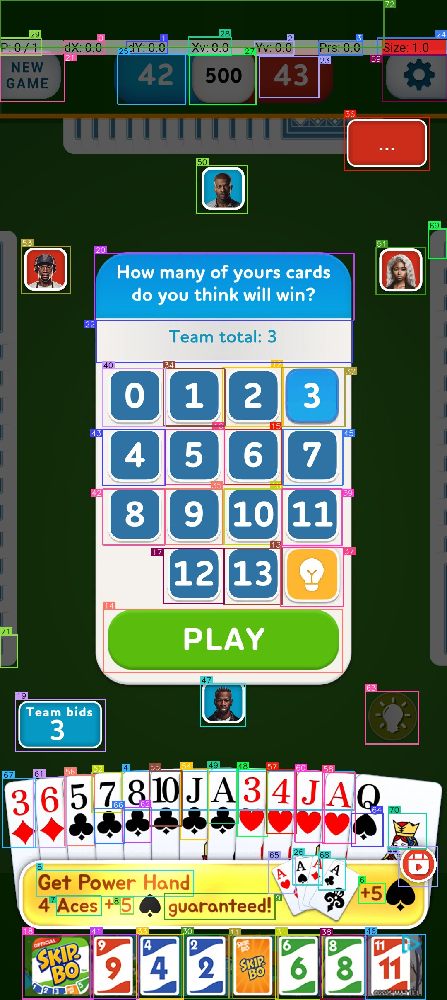

# Andrey

AI agent that plays Android games autonomously. Connects to a phone via ADB, captures screenshots, detects UI elements with [OmniParser](https://github.com/microsoft/OmniParser), sends annotated frames to Claude's vision API, and executes the chosen actions on the device — in a multi-turn conversation loop.

[](https://www.youtube.com/shorts/9wH22hlTlms)
> *Early prototype (v1) — tap to watch on YouTube*

## How It Works

```
Screenshot → OmniParser (element detection) → Claude (tool-use API) → Execute action → repeat
```

1. **Capture** a stable screenshot from the Android device via ADB
2. **Detect** UI elements using OmniParser V2 (YOLOv8 + Florence-2 + OCR), producing numbered bounding boxes
3. **Send** the annotated screenshot + element list to Claude in a multi-turn conversation
4. **Claude picks tools** — `tap_element(id=5)` for detected elements, or `tap(x, y)` as fallback
5. **Execute** the action on the device, capture the result, detect elements again, return to Claude
6. Claude sees each result and can chain multiple actions per turn (e.g. select bid → tap PLAY)

The multi-turn conversation preserves context across actions, and a sliding window keeps the last 8 screenshots to manage token usage.

### OmniParser Annotated Screenshot

Here's what Claude sees at each step — OmniParser draws numbered bounding boxes around every detected UI element:

<p align="center">
  
</p>

Claude reads the bounding box numbers visually and calls `tap_element(id=36)` to select bid "3", then `tap_element(id=14)` to hit PLAY — using exact coordinates from the detected element centers instead of guessing pixels.

## Requirements

- Python 3.10+
- Android device with USB debugging enabled
- ADB server running (`adb start-server`)
- [Anthropic API key](https://console.anthropic.com/)
- (Optional) OmniParser V2 for UI element detection

## Installation

```bash
pip install -e .
```

Set your API key:
```bash
export ANTHROPIC_API_KEY="sk-ant-..."
```

### OmniParser Setup (recommended)

OmniParser runs locally on Apple Silicon (MPS), CUDA, or CPU. It adds ~3.5s per frame on MPS but dramatically improves action accuracy by detecting exact element bounding boxes.

```bash
# Clone OmniParser
git clone https://github.com/microsoft/OmniParser.git ~/OmniParser

# Download weights (~2-3 GB)
huggingface-cli download microsoft/OmniParser-v2.0 --local-dir ~/OmniParser/weights

# Install OmniParser dependencies
pip install -e '.[omniparser]'
```

Create a `config.yaml` pointing to OmniParser:
```yaml
omniparser:
  enabled: true
  omniparser_path: "/path/to/OmniParser"
  weights_path: "/path/to/OmniParser/weights"
  device: "mps"  # or "cuda" or "cpu"
```

Without OmniParser, the agent falls back to raw screenshots with coordinate-based tapping.

## Usage

```bash
# Play a game (uses default profile)
andrey play

# Play Spades with verbose logging
andrey play --profile spades -v

# Run for 20 steps with 2s delay between actions
andrey play --profile spades --steps 20 --delay 2

# Run without OmniParser
andrey play --no-omniparser

# Save OmniParser annotated screenshots for debugging
andrey play --profile spades --save-annotated

# Pass extra context to the LLM
andrey play --profile spades --context "Focus on winning tricks, bid conservatively"

# Take a single screenshot and describe it
andrey screenshot --save screen.png

# List connected devices
andrey devices

# Tap a specific coordinate
andrey tap 540 1200
```

### CLI Options for `play`

| Option | Description |
|---|---|
| `--profile, -p` | Game profile name (from `game_profiles/`) |
| `--device, -d` | ADB device serial number |
| `--steps, -n` | Number of steps (actions) to execute (default 100) |
| `--delay` | Seconds between steps |
| `--context` | Extra context string for the LLM |
| `--max-images` | Max screenshots kept in conversation context (default 8) |
| `--omniparser-path` | Path to OmniParser repo |
| `--no-omniparser` | Disable OmniParser element detection |
| `--save-annotated` | Save annotated screenshots alongside raw ones |

## Session Logging

Every `play` session writes a `session.log` to the screenshots directory with full debug output — Claude's reasoning, tool calls, element lists, and execution results. Use `--save-annotated` to also save the OmniParser annotated screenshots alongside raw ones.

```
screenshots/
  session.log              # Full debug log
  step_0000.jpg            # Raw screenshot
  step_0000_annotated.jpg  # OmniParser annotated (with --save-annotated)
  step_0001.jpg
  ...
```

## Game Profiles

Game profiles live in `game_profiles/` as YAML files. They provide game-specific context, rules, and tips to the LLM.

```yaml
name: "Spades"
app_package: "com.youxi.spades"

system_context: |
  You are playing the card game Spades on an Android phone.

rules: |
  - Spades is always trump.
  - You must follow suit if possible.
  ...

tips: |
  - During bidding, count your high cards and spades.
  - BIDDING UI: first tap the number element, then tap PLAY.
  ...
```

A `default.yaml` profile is included for generic games. To add a new game, create a YAML file in `game_profiles/` with the fields above.

## Configuration

Copy `config.example.yaml` to `config.yaml` and edit:

```yaml
anthropic:
  api_key: ""          # or set ANTHROPIC_API_KEY env var
  model: "claude-sonnet-4-20250514"
  max_tokens: 1024

loop:
  delay_seconds: 1.5   # pause between steps
  max_steps: 100        # total actions before stopping
  error_threshold: 5    # consecutive errors before stopping

conversation:
  max_images: 8         # max screenshots in context window

device:
  serial: null          # null = auto-detect single device
  adb_host: "127.0.0.1"
  adb_port: 5037

omniparser:
  enabled: true
  omniparser_path: ""   # auto-detect ~/OmniParser if empty
  device: "mps"         # mps, cuda, or cpu

game_profile: "default"
save_screenshots: true
save_annotated: false
screenshot_dir: "./screenshots"
```

## Architecture

```
src/andrey/
  agent.py       — Main observation-action loop with tool dispatch
  vision.py      — ConversationClient (multi-turn) + VisionClient (single-turn)
  omniparser.py  — OmniParser V2 wrapper with graceful fallback
  models.py      — Tool definitions, ToolCall, ApiResponse, GameAction
  prompts.py     — System prompt builder + game profile loader
  device.py      — ADB device manager (screenshots, taps, swipes, keys)
  config.py      — Pydantic config models + YAML loading
  cli.py         — Click CLI entry point
  logger.py      — Logging setup with file output
```

### Available Tools

The agent exposes these tools to Claude:

| Tool | Description |
|---|---|
| `tap_element(element_id)` | Tap a detected UI element by its OmniParser ID (preferred) |
| `tap(x, y)` | Tap at raw pixel coordinates (fallback) |
| `swipe(x1, y1, x2, y2)` | Swipe gesture |
| `long_press(x, y)` | Long press |
| `press_key(BACK\|HOME\|ENTER)` | Android system key |
| `wait(seconds)` | Wait without acting |
| `game_over(reason)` | Signal the game has ended |

## v1 vs v2

| | v1 | v2 |
|---|---|---|
| **Vision** | OpenAI GPT-4o | Claude Sonnet (Anthropic) |
| **Interaction** | Single-turn, coordinate grid | Multi-turn tool-use conversation |
| **Element detection** | None (guessed pixel coords) | OmniParser V2 (YOLOv8 + Florence-2) |
| **Accuracy** | ~50-120px error on buttons | Exact bounding box centers |
| **Multi-step actions** | Not possible | Natural (bid → PLAY in one cycle) |
| **Context** | None between actions | Full conversation history |
| **Cost optimization** | Image scaling to 200px | Sliding window (8 images) |

## Known Limitations

- **Unity games** render everything on a single canvas, so Android accessibility tools don't work — OmniParser's vision-based detection is the only option
- OmniParser adds ~3.5s latency per frame on Apple Silicon MPS
- `transformers` must be `<5` (v5 breaks Florence-2 custom code in OmniParser)
- Banner ads at the bottom of the screen can occasionally steal taps
