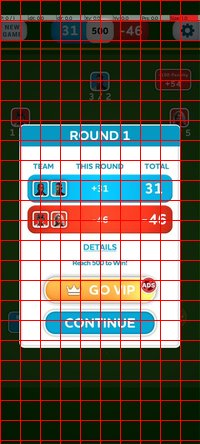

# Andrey by VG Labs

**Andrey** is an AI-powered Android automation agent that uses OpenAI Vision API and ADB (Android Debug Bridge) to control Android devices through natural language commands. Built as part of the VG Labs toolkit for accelerating mobile game development and publishing.

## 🎮 Demo

Watch Andrey autonomously playing a mobile game on Android emulator:

[](https://www.youtube.com/shorts/9wH22hlTlms)

*🎥 [Click to watch the demo](https://www.youtube.com/shorts/9wH22hlTlms) - See how Andrey uses computer vision and natural language processing to understand game interfaces and make intelligent decisions in real-time.*

> **"Just tell Andrey what to do, and watch it play!"** - No manual controls needed, just natural language commands.

## 🚀 Features

- **Natural Language Control**: Execute complex tasks using simple instructions like "Open YouTube and play the first video"
- **Computer Vision**: Uses OpenAI Vision API to understand and analyze device screenshots
- **Grid-Based Coordinates**: Innovative grid overlay system for easier and more consistent coordinate selection
- **ADB Integration**: Direct Android device control through Android Debug Bridge
- **Loop Detection**: Intelligent detection and handling of action loops
- **Progress Tracking**: Real-time progress callbacks and execution summaries
- **Error Handling**: Robust error handling and recovery mechanisms
- **Well-Documented**: Comprehensive documentation and examples

## 📋 Requirements

- Python 3.8 or higher
- Android device with USB debugging enabled
- ADB (Android Debug Bridge) installed
- OpenAI API key

## 🛠️ Installation

### 1. Install the Library

```bash
pip install -r requirements.txt
```

Or install in development mode:

```bash
pip install -e .
```

### 2. Install ADB (Android Debug Bridge)

#### Option A: Install Android SDK Platform Tools
Download from [Android Developer website](https://developer.android.com/studio/command-line/adb)

#### Option B: Using Package Managers
```bash
# macOS with Homebrew
brew install android-platform-tools

# Ubuntu/Debian
sudo apt-get install android-tools-adb

# Windows with Chocolatey
choco install adb
```

### 3. Setup Android Device

1. **Enable Developer Options**:
   - Go to Settings → About Phone
   - Tap "Build Number" 7 times
   - Developer Options will appear in Settings

2. **Enable USB Debugging**:
   - Go to Settings → Developer Options
   - Enable "USB Debugging"

3. **Connect Device**:
   - Connect your Android device via USB
   - Allow USB debugging when prompted
   - Verify connection: `adb devices`

### 4. Get OpenAI API Key

1. Visit [OpenAI API Platform](https://platform.openai.com/api-keys)
2. Create an account or sign in
3. Generate a new API key
4. Set environment variable:
   ```bash
   export OPENAI_API_KEY="your-api-key-here"
   ```

## 🎯 Quick Start

### Command Line Interface (Recommended)

```bash
# Set your OpenAI API key
export OPENAI_API_KEY="your-api-key-here"

# Run tasks directly from command line
python mobile_agent_cli.py --task "Open YouTube and play first video"
python mobile_agent_cli.py --task "Go to Settings" --model gpt-4o-mini
python mobile_agent_cli.py --task "Take a screenshot" --max-steps 5

# Check setup and get help
python mobile_agent_cli.py --check-setup
python mobile_agent_cli.py --help
```

### Python API Usage

```python
from mobile_agent import MobileAgent

# Initialize the agent
agent = MobileAgent(openai_api_key="your-api-key")

# Execute a simple instruction
result = agent.execute_instruction("Go to the home screen")
print(f"Task completed: {result['completed']}")

# Execute a complex instruction
result = agent.execute_instruction("Open YouTube and play the first video")
```

### With Progress Tracking

```python
def progress_callback(step, action_plan):
    print(f"Step {step}: {action_plan['action']}")
    print(f"Reasoning: {action_plan['reasoning']}")

agent = MobileAgent(openai_api_key="your-api-key")
result = agent.execute_instruction(
    "Open Settings and change WiFi password",
    progress_callback=progress_callback
)
```

### Using Context Manager

```python
with MobileAgent(openai_api_key="your-api-key") as agent:
    # Take a screenshot
    screenshot_path = agent.get_current_screenshot()
    
    # Get device info
    device_info = agent.get_device_info()
    print(f"Device: {device_info['model']}")
    
    # Execute instruction
    result = agent.execute_instruction("Open camera and take a photo")
    
    # Cleanup is automatic
```

## 📖 API Reference

### MobileAgent Class

#### Constructor
```python
MobileAgent(
    openai_api_key: str = None,
    adb_path: str = "adb", 
    config: MobileAgentConfig = None,
    **kwargs
)
```

#### Main Methods

- **`execute_instruction(instruction, max_steps=None, progress_callback=None)`**
  - Execute a natural language instruction
  - Returns execution summary

- **`get_current_screenshot()`**
  - Take a screenshot of current device state
  - Returns path to screenshot file

- **`get_device_info()`**
  - Get device information (model, Android version, screen size)
  - Returns dictionary with device details

- **`go_to_home()`**
  - Navigate to device home screen

- **`open_app(app_name)`**
  - Open an app by name (e.g., "YouTube", "Settings")

- **`stop_execution()`**
  - Stop current instruction execution

### Configuration

```python
from mobile_agent.config import MobileAgentConfig

 config = MobileAgentConfig(
     openai_api_key="your-key",
     max_iterations=20,          # Max steps per instruction
     step_delay=2.0,            # Delay between actions
     screenshot_quality=0.5,     # Screenshot scale factor
     openai_model="gpt-4o"      # Current OpenAI vision model
 )

agent = MobileAgent(config=config)
```

## 📸 Screenshots and Debugging

The agent automatically saves screenshots during execution for debugging and analysis:

### Screenshot Files
- **Original screenshots**: Saved to `./screenshots/` directory as `step_000.jpg`, `step_001.jpg`, etc.
- **Scaled screenshots with grid**: Saved as `step_000_scaled.jpg`, `step_001_scaled.jpg`, etc.
  - These show exactly what the LLM sees (scaled to 200px width with red grid overlay)
  - Red grid lines divide the image into 10×10 pixel cells for coordinate selection
  - Useful for debugging coordinate issues and understanding LLM decisions
  - Dramatically smaller file sizes for faster processing

### Image Processing
- Screenshots are automatically scaled to 200px width before sending to OpenAI Vision API
- **Grid Overlay**: Red grid lines (10×10 pixel cells) are added to scaled images for easier coordinate selection
- **Grid-Based Coordinates**: OpenAI works with grid cells instead of pixels (e.g., cell [5, 10] instead of pixel [105, 247])
- **Natural Tapping**: Random offsets within cells simulate realistic finger tapping behavior
- Reduces token costs by ~90% while maintaining UI element visibility
- Coordinates are automatically converted from grid cells to device pixels for execution
- Maintains aspect ratio and uses high-quality LANCZOS resampling

### Screenshot Management
```bash
# Keep screenshots for debugging (default)
python mobile_agent_cli.py --task "Open YouTube"

# Remove screenshots after execution
python mobile_agent_cli.py --task "Go home" --cleanup-screenshots
```

### Using Screenshots for Debugging
```python
# Get current screenshot
with MobileAgent(openai_api_key="your-key") as agent:
    screenshot_path = agent.get_current_screenshot()
    print(f"Screenshot saved: {screenshot_path}")
    
    # Execute task and check scaled versions
    result = agent.execute_instruction("Open Settings")
    
         # Check ./screenshots/ for both original and scaled versions
```

## 🔲 Grid-Based Coordinate System

Andrey uses an innovative grid-based coordinate system that makes OpenAI's job easier and simulates realistic human touch behavior:

### How It Works
1. **Image Scaling**: Screenshots are scaled to 200px width for efficiency
2. **Grid Overlay**: Red grid lines create 10×10 pixel cells over the scaled image  
3. **Grid Coordinates**: OpenAI selects cells (e.g., [5, 10]) instead of precise pixels
4. **Natural Tapping**: Random offsets within cells simulate finger tapping variation
5. **Device Conversion**: Grid coordinates are converted back to device pixels for execution

### Benefits
- **Easier for AI**: Discrete grid cells are simpler than continuous pixel coordinates
- **More Realistic**: Humans don't tap precise pixels - they tap approximate areas
- **Consistent**: Grid-based selection reduces coordinate precision errors
- **Visual Debug**: Grid overlay helps debug what the AI sees and selects
- **Intuitive**: Top-left origin matches standard screen coordinate conventions
- **Direct Mapping**: Grid coordinates match the visual grid overlay exactly

### Example Coordinate Flow
```
Original screenshot: 720×1600 pixels
      ↓ Scale to 200px width
Scaled image: 200×444 pixels  
      ↓ Add 20×20px grid overlay
Grid system: 10×22 cells (top-left origin)
        ↓ OpenAI selects cell [5, 10] (top-left based)
Random offset: [105.2, 205.8] in scaled pixels
      ↓ Scale back to device
Device coordinate: [378, 741] pixels
      ↓ Execute tap
ADB tap command
```

### Grid Overlay Visualization



**What you're seeing:**
- **Red grid lines** divide the scaled image (200px width) into 20×20 pixel cells
- **Grid coordinates** use a 10×22 cell system (10 cells wide, 22 cells tall)
- **AI-friendly selection**: Instead of specifying precise pixels like [105, 247], OpenAI selects intuitive grid cells like [5, 12]
- **Natural tapping simulation**: Each cell represents a finger-sized tap area (20×20 pixels = realistic touch target)
- **Clear visual reference**: Grid lines show exactly what coordinate space the AI is working with

**In this example:**
- The blue "CONTINUE" button would be around cells [4, 19] (center-bottom area)
- Grid cell [0, 0] is the top-left corner, [9, 21] is bottom-right corner
- Each grid cell is large enough to reliably hit UI elements without pixel-perfect precision

This approach makes mobile automation more reliable and intuitive - just like how humans naturally tap areas rather than exact pixel coordinates.

### Grid Visualization
```
Grid Cell [0,0] = Top-left corner (like screen coordinates)
Grid Cell [19,43] = Bottom-right corner (for 200×444 image)
Each cell = 10×10 pixels in scaled image
Red lines mark cell boundaries in saved screenshots

Coordinate System:
- Origin (0,0) at TOP-LEFT corner
- X increases left → right  
- Y increases top → bottom
- Matches standard screen/UI coordinate convention
```

## 🎯 Example Instructions

### Simple Tasks
- "Go to the home screen"
- "Open Settings"
- "Take a screenshot"
- "Press the back button"

### App Operations
- "Open YouTube"
- "Open Chrome and navigate to google.com"
- "Open Camera and switch to video mode"
- "Open Messages and send a text to John"

### Complex Tasks
- "Open YouTube and play the first video"
- "Go to Settings, find WiFi settings, and show saved networks"
- "Open Chrome, search for 'weather', and show today's forecast"
- "Open Gallery, find photos from last week, and select the first one"

## 💻 Command Line Interface

The Mobile Agent CLI provides a powerful command-line interface for automation:

### Basic Commands

```bash
# Execute any task
python mobile_agent_cli.py --task "Your instruction here"

# Use cheaper model
python mobile_agent_cli.py --task "Open YouTube" --model gpt-4o-mini

# Limit execution steps
python mobile_agent_cli.py --task "Go to Settings" --max-steps 5

# Quick screenshot
python mobile_agent_cli.py --screenshot-only

# Device information
python mobile_agent_cli.py --device-info
```

### Advanced Options

```bash
# Verbose logging for debugging
python mobile_agent_cli.py --task "Open app" --verbose

# Custom delays and quality
python mobile_agent_cli.py --task "Take screenshot" --step-delay 1.0 --screenshot-quality 0.8

# No progress output (for scripts)
python mobile_agent_cli.py --task "Go home" --no-progress

# Check your setup
python mobile_agent_cli.py --check-setup
```

### CLI Parameters

| Parameter | Short | Description | Default |
|-----------|-------|-------------|---------|
| `--task` | `-t` | Natural language task to execute | Required |
| `--model` | `-m` | OpenAI model (gpt-4o, gpt-4o-mini) | gpt-4o |
| `--max-steps` | `-s` | Maximum execution steps | 20 |
| `--screenshot-quality` | `-q` | Screenshot scale factor | 0.5 |
| `--step-delay` | `-d` | Delay between actions (seconds) | 2.0 |
| `--verbose` | `-v` | Enable verbose logging | False |
| `--no-progress` |  | Disable progress output | False |
| `--screenshot-only` |  | Just take screenshot and exit | False |
| `--device-info` |  | Show device info and exit | False |

## 🔧 Advanced Usage

### Custom Action Handlers

```python
from mobile_agent import MobileAgent, ActionExecutor

class CustomActionExecutor(ActionExecutor):
    def handle_common_scenarios(self, action_plan, instruction):
        # Custom logic for specific scenarios
        if "camera" in instruction.lower():
            # Special handling for camera operations
            pass
        return super().handle_common_scenarios(action_plan, instruction)

# Use custom executor
agent = MobileAgent(openai_api_key="your-key")
agent.action_executor = CustomActionExecutor(agent.adb_controller, agent.config)
```

### Batch Processing

```python
instructions = [
    "Go to home screen",
    "Open Settings", 
    "Navigate to Display settings",
    "Change brightness to maximum"
]

agent = MobileAgent(openai_api_key="your-key")
for instruction in instructions:
    result = agent.execute_instruction(instruction)
    if not result['completed']:
        print(f"Failed: {instruction}")
        break
```

## 🛡️ Error Handling

```python
try:
    agent = MobileAgent(openai_api_key="your-key")
    result = agent.execute_instruction("Complex task")
    
    if result['final_status'] == 'COMPLETED':
        print("Task completed successfully!")
    elif result['final_status'] == 'ERROR':
        print("Task failed with error")
    elif result['final_status'] == 'MAX_STEPS_REACHED':
        print("Task exceeded maximum steps")
        
except ValueError as e:
    print(f"Configuration error: {e}")
except RuntimeError as e:
    print(f"ADB connection error: {e}")
except Exception as e:
    print(f"Unexpected error: {e}")
```

## 🔍 Troubleshooting

### Common Issues

#### ADB Not Found
```bash
# Verify ADB installation
adb version

# Add ADB to PATH or specify full path
agent = MobileAgent(adb_path="/path/to/adb")
```

#### No Devices Found
```bash
# Check connected devices
adb devices

# If empty, check:
# 1. USB debugging enabled
# 2. USB cable connected
# 3. Device authorization granted
```

#### OpenAI API Errors
- Verify API key is correct
- Check API quota and billing
- Ensure you have access to vision models
- If you don't have access to `gpt-4o`, try `gpt-4o-mini` (cheaper alternative)
- Note: `gpt-4-vision-preview` has been deprecated, use `gpt-4o` instead

#### Vision Analysis Issues
- Ensure screenshots are clear and visible
- Check if UI elements are properly rendered
- Try adjusting screenshot quality in config

### Debug Mode

```python
import logging

# Enable debug logging
logging.getLogger('mobile_agent').setLevel(logging.DEBUG)

agent = MobileAgent(openai_api_key="your-key")
# More detailed logs will be shown
```

## 🧪 Testing

### Quick Setup Check
Test your entire setup with one command:

```bash
python mobile_agent_cli.py --check-setup
```

### Basic Testing
Test with a simple task:

```bash
# Command line (recommended)
python mobile_agent_cli.py --task "Take a screenshot"

# Or use examples
cd examples
python basic_example.py
```

### YouTube Example Testing
Test the YouTube functionality:

```bash
# Command line mode
python examples/youtube_example.py --task "Open YouTube"

# Interactive mode
python examples/youtube_example.py
```

### Model Testing
If you encounter model issues:

```bash
# List available models
python mobile_agent_cli.py --list-models

# Test with cheaper model
python mobile_agent_cli.py --task "Go to home screen" --model gpt-4o-mini

# Or use model selection example
python examples/model_selection_example.py
```

## 📝 Contributing

1. Fork the repository
2. Create a feature branch
3. Add tests for new functionality
4. Ensure all tests pass
5. Submit a pull request

## 📄 License

This project is licensed under the MIT License - see the LICENSE file for details.

## 🙏 Acknowledgments

- [OpenAI](https://openai.com/) for the Vision API
- [MobileAgent](https://github.com/X-PLUG/MobileAgent) project for inspiration
- Android Debug Bridge (ADB) for device communication

## 🆘 Support

- Create an issue on GitHub for bug reports
- Check existing issues for solutions
- Read the troubleshooting section above

## 🚧 Roadmap

- [ ] iOS support via instruments/WebDriverAgent
- [ ] GUI interface for non-technical users
- [ ] Integration with CI/CD pipelines
- [ ] Multi-device support
- [ ] Action recording and playback
- [ ] Custom model support (local vision models)

---

**Happy Automating with Andrey! 🤖**  
© VG Labs – Accelerating Mobile Game Innovation
